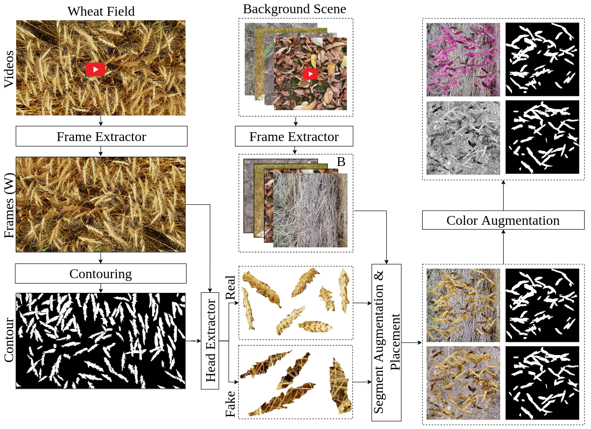

# Image Synthesis Pipeline
- - -
This pipeline includes all the needed tools for synthesizing images using the cut-and-paste approach in overlapping wheat spikes on the background images.
<p align="center">
  
</p>


### Code configuration and run:
To implement the code we used Python version 3.9, and a version of the packages can be installed through installing all the required packages.

1. In order to install the required packages please run the following command using `pip`: 
   ```bash
      pip install -r requirements.txt
   ```
> In order to run each python script you first need to change the related configuration file in the `config/` folder for each file.

2. In order to extract frames from videos:
   1. Change the configuration file named **frames_extractor.yaml** in the **configs/** folder.  
   2. Run the following command in the terminal:
   ```bash
      python3 frames_extractor.py --config configs/frames_extractor.yaml
   ```       
3. In order to extract real and fake objects from the segmented representative image:
   1. Change the configuration file named **objects_extractor.yaml** in the **configs/** folder. 
   2. Run the following command in the terminal:
   ```bash
      python3 objects_extractor.py --config configs/objects_extractor.yaml
   ```  
4. In order to simulate the dataset using the previously extracted background frames and real and fake objects:
   1. Change the configuration file named **simulation.yaml** in the **configs/** folder. 
   2. Run the following command in the terminal:
   ```bash
      python3 simulation.py --config configs/simulation.yaml
   ```  
### 📝 Cite
```
@article{
    doi:10.34133/plantphenomics.0025,
    author = {Keyhan Najafian  and Alireza Ghanbari  and Mahdi Sabet Kish  and Mark Eramian  and Gholam Hassan Shirdel  and Ian Stavness  and Lingling Jin  and Farhad Maleki },
    title = {Semi-Self-Supervised Learning for Semantic Segmentation in Images with Dense Patterns},
    journal = {Plant Phenomics},
    volume = {5},
    number = {},
    pages = {0025},
    year = {2023},
    doi = {10.34133/plantphenomics.0025},
    URL = {https://spj.science.org/doi/abs/10.34133/plantphenomics.0025},
    eprint = {https://spj.science.org/doi/pdf/10.34133/plantphenomics.0025}
}
```
